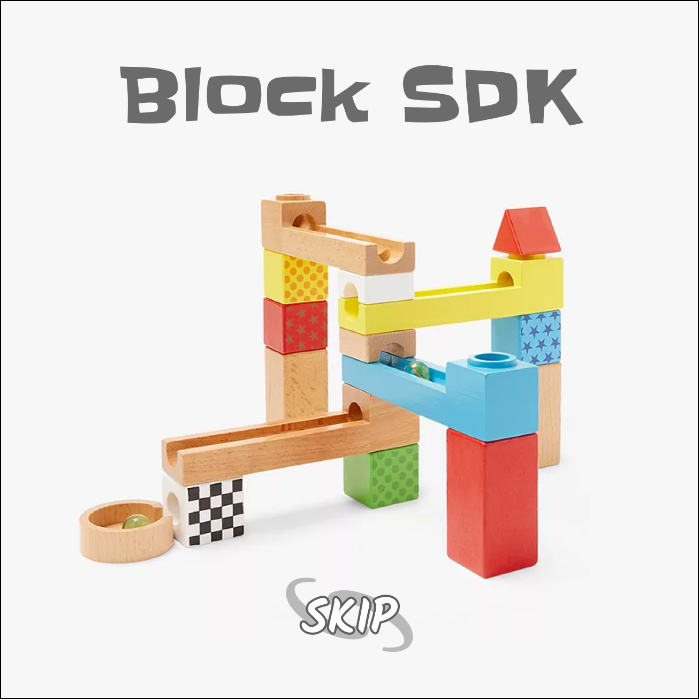

<h1 align="center">Block SDK 🧱</h1>

<!-- markdownlint-disable MD013 -->
<!-- markdownlint-disable MD041 -->

  

  
  
    

### 🤔 What is the Block SDK?

> **Note**: The BlockSDK is open source software that Skip maintains. We strive to be responsive to questions and issues within 1-2 weeks - please ask in our [#block-sdk-support discord](https://discord.com/invite/hFeHVAE26P) channel, or open a GitHub issue!

Please note, we are not currently providing hands-on support for new integrations.

**🌐 The Block SDK is a toolkit for building customized blocks**. The Block SDK is a set of Cosmos SDK and ABCI++ primitives that allow chains to fully customize blocks to specific use cases. It turns your chain's blocks into a **`highway`** consisting of individual **`lanes`** with their own special functionality.

Skip has built out a number of plug-and-play `lanes` on the SDK that your protocol can use, including in-protocol MEV recapture and Oracles! Additionally, the Block SDK can be extended to add **your own custom `lanes`** to configure your blocks to exactly fit your application needs.

### 📚 Block SDK Documentation

To read more about how the Block SDK works, check out the [How it Works](https://docs.skip.money/chains/overview).

#### 🏪 Lane App Store

To read more about Skip's pre-built `lanes` and how to use them, check out the [Lane App Store](https://docs.skip.money/chains/lanes/existing-lanes/default).

#### 🎨 Lane Development

To read more about how to build your own custom `lanes`, check out the [Build Your Own Lane](https://docs.skip.money/chains/lanes/build-your-own-lane).

### Audits 

The Block SDK has undergone audits by the following firms:

* [OtterSec (Sept 9th, 2023)](audits/ottersec_sept_9_2023.pdf): Post audit code released as [v1.2.0](https://github.com/skip-mev/block-sdk/releases/tag/v1.2.0 and [v2.0.0](https://github.com/skip-mev/block-sdk/releases/tag/v2.0.0) for the `v1.x.x` and `v2.x.x` release families, respectively.
